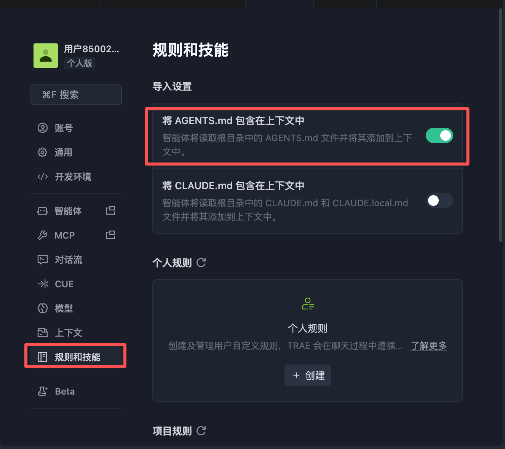

# 项目本地运行说明

> 适用人群：产品同学在本地电脑查看和运行项目。

---

## 第一次使用：安装依赖

在项目根目录打开终端，执行： 或者叫 AI直接启动项目，AI会自动下载依赖

```bash
npm install
```

> 只需执行一次，后续启动不需要重复安装。

---

## 启动项目

```bash
npm run dev
```

启动成功后，终端会显示类似如下信息：

```
  ➜  Local:   http://localhost:5175/
```

打开浏览器，访问对应地址即可使用。

---

## 重启项目

如果需要重启（如代码更新后），在终端：

1. 先停止当前服务：按 `Ctrl + C`
2. 再重新启动：

```bash
npm run dev
```

---

## 常见问题

**Q: 端口号不是 5175，访问不了？**

Vite 如果检测到端口被占用，会自动换一个（如 5176、5177 等）。请以终端实际输出的地址为准。

**Q: 提示找不到命令 `npm`？**

请先安装 [Node.js](https://nodejs.org/)（推荐 LTS 版本），安装完成后重新打开终端再试。


trae设置说明：
